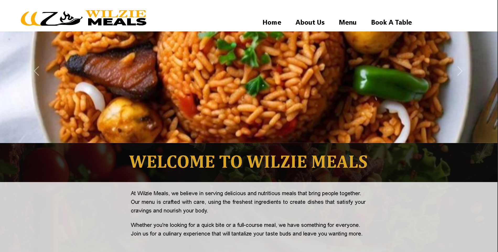
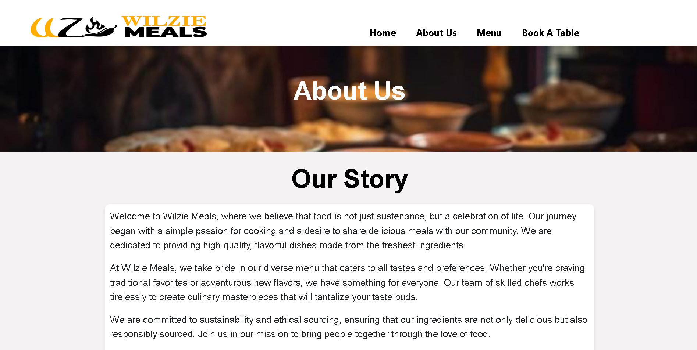
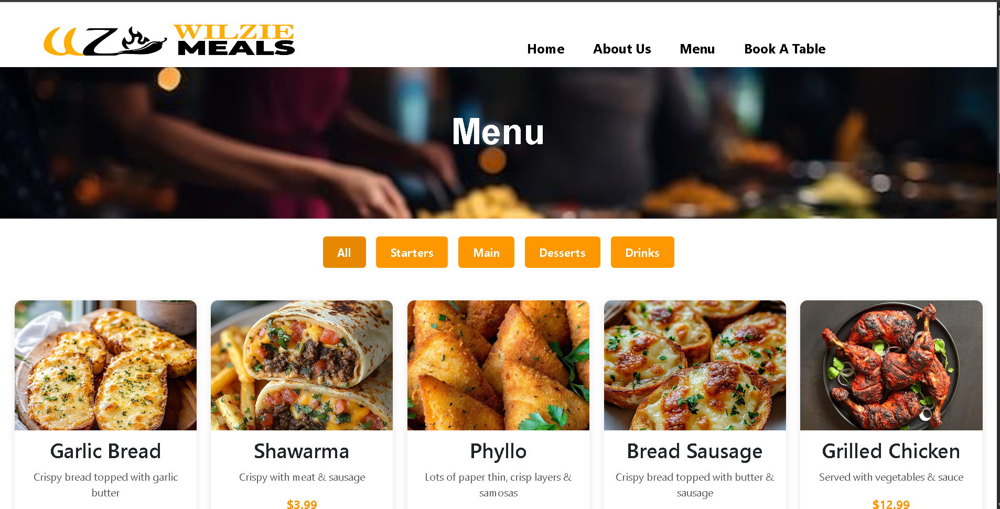
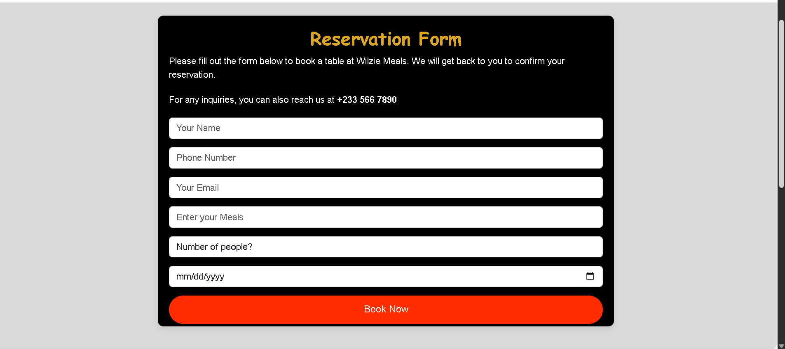

# Wilzie Meals

Wilzie Meals is a modern restaurant website designed to provide customers with an engaging online dining experience. The platform showcases the restaurant's menu, featured dishes, and services while allowing customers to conveniently reserve tables through an integrated booking system.

## Features

* Responsive and user-friendly design
* Interactive restaurant menu display
* Table reservation and booking form
* Contact page for customer inquiries
* Modern UI with smooth navigation
* Mobile-friendly layout

## Technologies Used

* HTML5
* CSS3
* JavaScript
* PHP
* MySQL
* Bootstrap

## Project Structure

```text
wilzie_meals/
├── admin/
├── assets/
├── dbconnect/
├── save_actions/
├── index.php
├── menu.php
├── aboutus.php
├── contact.php
└── README.md
```


## Screenshots

### Homepage


### About Page


### Menu Page


### Reservation Form



## Live Demo

Coming soon 

## Author

GitHub: https://github.com/ezekell-tech
Portfolio: https://ezekelldev-portfolio.gt.tc


